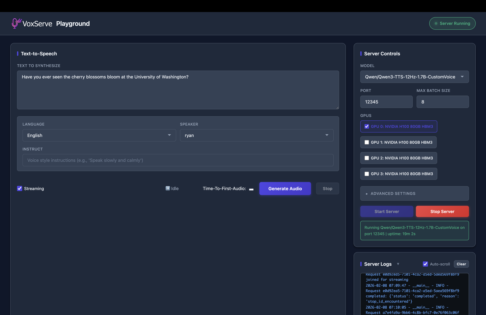

<p align="center">
  <picture>
    <source media="(prefers-color-scheme: dark)" srcset="docs/_static/images/logo-dark.png">
    <source media="(prefers-color-scheme: light)" srcset="docs/_static/images/logo-light.png">
    
  </picture>
</p>

<h1 align="center">VoxServe</h1>
<p align="center"><strong>A High-Performance Serving System for Speech Language Models</strong></p>

<p align="center">
  <a href="https://pypi.org/project/vox-serve/"></a>
  <a href="https://arxiv.org/abs/2602.00269"></a>
  <a href="https://vox-serve.github.io/vox-serve/"></a>
</p>

VoxServe delivers low-latency, high-throughput inference for Speech Language Models (SpeechLMs), including text-to-speech (TTS) and speech-to-speech (STS) models.

## News

- **[2025-02]** Blog post: [Light-Speed Qwen3-TTS Serving at Scale with VoxServe](https://vox-serve.github.io/2026/02/09/qwen3-tts-support.html)
- **[2025-02]** Paper released: [VoxServe: A Streaming-Centric Serving System for Speech Language Models](https://arxiv.org/abs/2602.00269)

## Quick Start

Install via pip and start the server:

```bash
pip install vox-serve
vox-serve --model <model-name> --port <port-number>
```

Or install from source:

```bash
git clone https://github.com/vox-serve/vox-serve.git
cd vox-serve
pip install -e .
python -m vox_serve.launch --model <model-name> --port <port-number>
```

Send requests to the server:

```bash
# Text-to-speech
curl -X POST "http://localhost:<port-number>/generate" \
  -F "text=Hello world" -F "streaming=true" -o output.wav

# Speech-to-speech (for models with audio input support)
curl -X POST "http://localhost:<port-number>/generate" \
  -F "text=Hello world" -F "@input.wav" -F "streaming=true" -o output.wav
```

See the [`examples/`](examples/) directory for more usage examples.

## Running the Server

Launch a server with `python -m vox_serve.launch` (or the `vox-serve` console script):

```bash
python -m vox_serve.launch \
  --model zonos \
  --host 0.0.0.0 --port 8000 \
  --scheduler-type online \
  --async-scheduling \
  --max-batch-size 64
```

Common options (see `python -m vox_serve.launch --help` for the full list):

| Flag | Default | Description |
|------|---------|-------------|
| `--model` | `canopylabs/orpheus-3b-0.1-ft` | Model name (see table below) or HF path |
| `--host` | `0.0.0.0` | Bind address |
| `--port` | `8000` | Bind port |
| `--scheduler-type` | `base` | `base`, `online`, `offline`, or `input_streaming` |
| `--async-scheduling` | off | Overlap scheduling with GPU work (lower latency) |
| `--max-batch-size` | `8` | Max concurrent requests batched together |
| `--max-num-pages` | `2048` | KV cache pages (raise for more concurrency) |
| `--enable-cuda-graph` / `--disable-cuda-graph` | on | CUDA graph capture for the decode phase |
| `--dp-size` | `1` | Data-parallel replicas across GPUs |
| `--enable-disaggregation` | off | Split LLM / detokenizer across 2 GPUs |
| `--log-level` | `INFO` | `DEBUG`, `INFO`, `WARNING`, `ERROR`, `CRITICAL` |

For the lowest streaming latency under load, use `--scheduler-type online --async-scheduling` and size `--max-batch-size` to your expected concurrency.

Check the server is up:

```bash
curl http://localhost:8000/health   # -> {"status":"healthy"}
```

## API Reference

Interactive OpenAPI docs are served at **`http://<host>:<port>/docs`** (Swagger UI) and **`/redoc`** once the server is running.

### `POST /generate` — synthesize speech

Multipart form fields:

| Field | Required | Description |
|-------|----------|-------------|
| `text` | yes | Text to synthesize |
| `streaming` | no (default `true`) | Stream a WAV (`true`) or return a complete file (`false`) |
| `sample_rate` | no (default `24000`) | Output sample rate in Hz: `16000` or `24000` |
| `audio` | no | Reference audio file for voice cloning (uploaded per request) |
| `voice_id` | no | Pre-registered voice (see `/voices`) — clone with **no per-request upload** |
| `language`, `speaker`, `ref_text`, `instruct`, `x_vector_only_mode` | no | Model-specific parameters |

```bash
# Default voice, streaming
curl -X POST http://localhost:8000/generate \
  -F "text=Hello world" -F "streaming=true" -o out.wav

# 16 kHz output
curl -X POST http://localhost:8000/generate \
  -F "text=Hello world" -F "streaming=true" -F "sample_rate=16000" -o out_16k.wav

# Voice cloning by uploading a reference each request
curl -X POST http://localhost:8000/generate \
  -F "text=Hello world" -F "audio=@reference.wav" -F "streaming=true" -o out.wav

# Voice cloning by pre-registered voice_id (recommended, no upload)
curl -X POST http://localhost:8000/generate \
  -F "text=Hello world" -F "voice_id=my-voice" -F "streaming=true" -o out.wav
```

### Voice registry — register once, clone without re-uploading

Uploading the reference audio on every request is wasteful over a network. Register a voice once and reference it by `voice_id`:

```bash
# Register (returns {"voice_id": "...", "bytes": N}); voice_id is optional
curl -X POST http://localhost:8000/voices \
  -F "audio=@reference.wav" -F "voice_id=my-voice"

# List registered voices
curl http://localhost:8000/voices          # -> {"voices": ["my-voice", ...]}

# Delete a voice
curl -X DELETE http://localhost:8000/voices/my-voice
```

Registered voices persist across restarts. The server also caches the computed speaker embedding, so repeated requests for the same voice skip re-encoding.

### `WS /ws` — persistent WebSocket streaming (lowest latency)

Open one connection and reuse it for many utterances, paying the TCP/TLS handshake only once. Optionally receive **Opus** audio (~8× smaller than raw PCM, transparent for speech).

Client → server (one JSON message per utterance):

```json
{"text": "Hello world", "voice_id": "my-voice", "format": "opus"}
```

`format` is `"pcm"` (raw int16, default) or `"opus"`. Use `"audio_base64"` for a one-off reference instead of `voice_id`. Optional `"sample_rate": 16000` (or `24000`, default) resamples the native 24 kHz model output; Opus encodes at the requested rate. Send `{"type": "close"}` to end the session.

**Zonos conditioning controls** (all optional, per utterance):

```json
{
  "text": "I'm so excited to see you!",
  "voice_id": "my-voice",
  "speaking_rate": 20,
  "pitch_std": 90,
  "emotion": [0.8, 0, 0, 0, 0.1, 0, 0, 0.1]
}
```

| field | range / format | meaning |
| --- | --- | --- |
| `speaking_rate` | phonemes/min (~15 normal, 30 fast, 10 slow) | speaking speed |
| `pitch_std` | 20–45 normal, 60–150 expressive | pitch variation / expressiveness |
| `emotion` | 8-value list `[happiness, sadness, disgust, fear, surprise, anger, other, neutral]` (auto-normalized) | emotional tone |

Emotion is entangled with pitch — stronger emotion usually pairs well with a higher `pitch_std`. Unset controls keep their Zonos defaults.

Server → client, per utterance:

```
{"type": "start", "request_id": "...", "sample_rate": 16000, "channels": 1, "format": "opus", "frame_ms": 20}
<binary frame> <binary frame> ...   # PCM chunks, or one Opus packet per frame
{"type": "end", "request_id": "..."}
```

Errors arrive as `{"type": "error", "detail": "..."}` without closing the socket. Opus bitrate defaults to 48 kbps (override with the `VOX_OPUS_BITRATE` env var).

### Incremental text input (`input_streaming` scheduler)

For LLM → TTS pipelines, start a request and feed text as it is generated. Requires `--scheduler-type input_streaming`.

```bash
# Start (optionally with -F "audio=@reference.wav"); returns {"request_id": "..."}
curl -X POST http://localhost:8000/generate/stream/start
curl -X POST http://localhost:8000/generate/stream/<request_id>/text -F "text=Hello "
curl -X POST http://localhost:8000/generate/stream/<request_id>/text -F "text=world."
curl        http://localhost:8000/generate/stream/<request_id>/audio -o out.wav   # stream audio
curl -X POST http://localhost:8000/generate/stream/<request_id>/end
```

### `POST /v1/audio/speech` — OpenAI-compatible

Streams raw int16 PCM. Accepts `{"input": "...", "voice": "...", "language": "...", "stream": true}`.

### Benchmarking / load testing

The [`benchmark/`](benchmark/) directory includes concurrency and TTFA testers:

```bash
# HTTP concurrency (byid = register-once voice, clone = upload each request, noclone)
python benchmark/concurrency_test.py 64 byid

# WebSocket + Opus concurrency (saves a playable ws_sample.wav)
python benchmark/ws_client.py 64 opus
```

## Supported Models

VoxServe supports the following TTS and STS models:

| Model | Type | Link |
|-------|------|------|
| `chatterbox` | TTS | [Chatterbox TTS](https://huggingface.co/ResembleAI/chatterbox) |
| `cosyvoice2` | TTS | [CosyVoice2-0.5B](https://huggingface.co/FunAudioLLM/CosyVoice2-0.5B) |
| `csm` | TTS | [CSM-1B](https://huggingface.co/sesame/csm-1b) |
| `orpheus` | TTS | [Orpheus-3B](https://huggingface.co/canopylabs/orpheus-3b-0.1-ft) |
| `qwen3-tts` | TTS | [Qwen3-TTS-1.7B](https://huggingface.co/collections/Qwen/qwen3-tts) |
| `zonos` | TTS | [Zonos-v0.1](https://huggingface.co/Zyphra/Zonos-v0.1-transformer) |
| `glm` | STS | [GLM-4-Voice-9B](https://huggingface.co/zai-org/glm-4-voice-9b) |
| `step` | STS | [Step-Audio-2-Mini](https://huggingface.co/stepfun-ai/Step-Audio-2-mini) |

See the [models documentation](https://vox-serve.github.io/vox-serve/models.html) for detailed information. More models coming soon.

## Demos

### Ultra-Low Latency

VoxServe is optimized for real-time speech synthesis. The demo below shows a TTS request achieving **40 ms** Time-To-First-Audio (TTFA) on an NVIDIA H100 GPU with `Qwen/Qwen3-TTS-12Hz-1.7B-CustomVoice`.

<a href="https://vimeo.com/1163095537">
  
</a>

### Real-Time LLM Integration

Qwen3-TTS supports incremental text input, enabling seamless integration with LLMs for voice chatbots. The demo below shows VoxServe connected to a local LLM with low end-to-end latency.

<a href="https://vimeo.com/1163095770">
  
</a>

## Playground

VoxServe includes a web-based playground for interactive testing. Use the browser UI to manage servers, generate audio, and view real-time logs.



See [examples/playground/README.md](examples/playground/README.md) for setup instructions.
